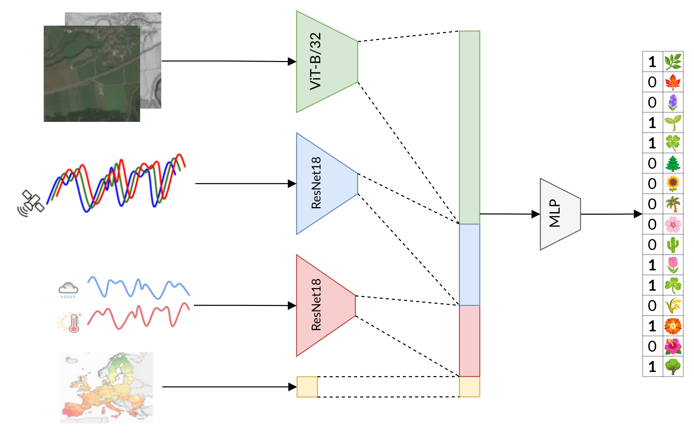

# GeoLifeCLEF 2024 Contest

This repository contains the source code for the solution to [GeoLifeCLEF 2024](https://www.kaggle.com/competitions/geolifeclef-2024)  Kaggle contest, which focuses on predicting plant species composition across space and time using a multimodal model. The challenge involves learning from a small amount of high-quality presence-absence multi-label data and a large number of presence-only single-label samples.
## Solution

The implemented solution ([src/clef_model.py](src/clef_model.py)) consists of a fusion of a visual transformer and two ResNet18 architectures.

Each modality is processed by a separate model:
- The visual transformer processes RGB and NIR images.
- ResNets extract essential information from time series.
- Standalone features are fed directly to the head classifier.

## Conference Poster

You can find the poster describing the solution under [docs/MLinPL-2024-GeoLifeCLEF.pdf](docs/MLinPL-2024-GeoLifeCLEF.pdf).

## Kaggle Score

|                     | Score   |
|---------------------|---------|
| Public leaderboard  | 0.32723 |
| Private leaderboard | 0.32825 |